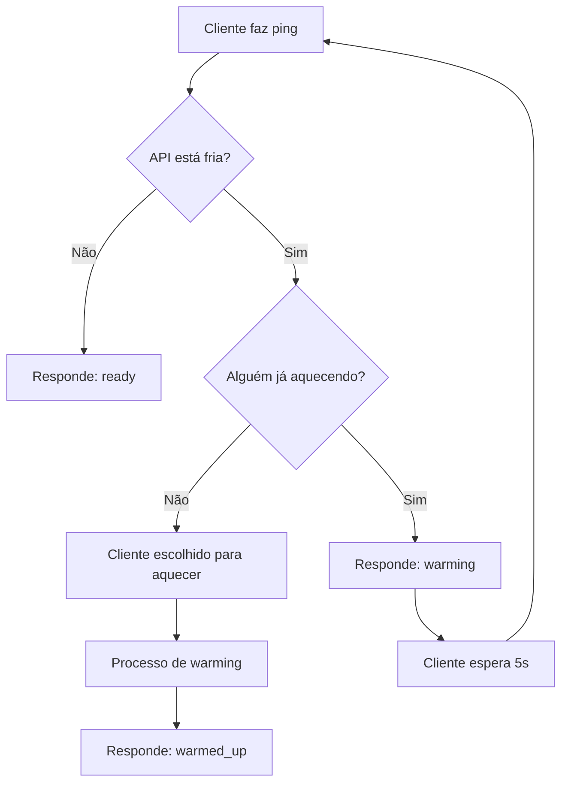

# Sistema de Ping Coordenado

## 🎯 Objetivo

O Sistema de Ping Coordenado foi desenvolvido para resolver o problema de **Cold Start** em APIs hospedadas em serviços como Render, Heroku, Railway, etc. Quando uma API fica inativa por um período, ela "dorme" e demora para responder nas primeiras requisições.

### Problemas que resolve:

- ❌ **Cold Start**: API lenta após período de inatividade
- ❌ **Sobrecarga**: Múltiplos clientes enviando pings simultâneos
- ❌ **Desperdício**: Pings desnecessários quando API já está ativa
- ❌ **Falta de coordenação**: Cada cliente tentando "acordar" a API individualmente

### Soluções implementadas:

- ✅ **Ping Coordenado**: Apenas um cliente "aquece" a API por vez
- ✅ **Estado Inteligente**: API sabe quando está fria/quente
- ✅ **Menos sobrecarga**: Reduz drasticamente requisições desnecessárias
- ✅ **Alta disponibilidade**: API sempre pronta para uso

---

## 🏗️ Arquitetura do Sistema

### Backend (Flask)
```
┌─────────────────────────────────────────────────────┐
│                 PingManager                         │
├─────────────────────────────────────────────────────┤
│ • Estado global thread-safe                        │
│ • Coordenação de warming                            │
│ • Tracking de atividade                             │
│ • Limpeza automática                                │
└─────────────────────────────────────────────────────┘
                            ↕
┌─────────────────────────────────────────────────────┐
│              Endpoints da API                       │
├─────────────────────────────────────────────────────┤
│ /ping           → Ping coordenado                   │
│ /ping/status    → Status do sistema                 │  
│ /api/*          → Endpoints que marcam atividade    │
└─────────────────────────────────────────────────────┘
```

### Frontend (Angular)
```
┌─────────────────────────────────────────────────────┐
│              KeepAPIService                         │
├─────────────────────────────────────────────────────┤
│ • Intervalos dinâmicos (5s → 5min)                 │
│ • Reação inteligente às respostas                   │
│ • Menos requisições desnecessárias                  │
└─────────────────────────────────────────────────────┘
```

---

## 🔄 Como Funciona

### 1. **Detecção de Cold Start**
```python
# API considera-se "fria" após 10 minutos sem atividade
COLD_START_THRESHOLD = 10 * 60  # 10 minutos
```

### 2. **Estados do Sistema**

| Estado | Descrição | Ação do Cliente |
|--------|-----------|-----------------|
| `ready` | API já está quente | Usar normalmente |
| `warming` | Outro cliente aquecendo | Aguardar 5s e tentar novamente |
| `warmed_up` | Este cliente aqueceu a API | API pronta para uso |
| `warming_failed` | Warming anterior falhou | Tentar novamente após 3s |

### 3. **Fluxo de Coordenação**



---

## 📊 Estados e Transições

### Estado Interno (PingState)
```python
@dataclass
class PingState:
    is_warming_up: bool = False           # Sistema em warming?
    warming_started_at: float = None      # Quando começou warming
    warming_client_id: str = None         # Qual cliente está aquecendo
    last_activity: float = None           # Última atividade da API
    waiting_clients: Dict[str, float]     # Clientes aguardando
```

### Máquina de Estados
```
   COLD ──────────────► WARMING ──────────────► READY
    ↑                      │                      │
    │                      ↓ (timeout)           │
    └──────────── COLD ←───────────────────────────┘
                  (10min sem atividade)
```

---

## 🛠️ Implementação

### Backend - PingManager

#### Método Principal
```python
@staticmethod
def update_last_activity():
    """Marca que a API teve atividade recente"""
    with _ping_lock:
        _ping_state.last_activity = time.time()
```

#### Como usar nos endpoints
```python
from ping_manager import PingManager

@app.route('/api/users', methods=['GET'])
def get_users():
    try:
        users = get_users_from_database()
        
        # ✅ Marca atividade após sucesso
        PingManager.update_last_activity()
        
        return jsonify({'users': users})
    except Exception as e:
        # ❌ Não marca atividade em caso de erro
        return jsonify({'error': str(e)}), 500
```

### Frontend - KeepAPIService

#### Intervalos Dinâmicos
```typescript
// Quando API está fria/aquecendo
private readonly PING_INTERVAL_COLD = 5000; // 5 segundos

// Quando API está ready  
private readonly PING_INTERVAL_WARM = 5 * 60 * 1000; // 5 minutos
```

#### Reação às Respostas
```typescript
switch (response.status) {
  case 'ready':
  case 'warmed_up':
    this.updatePingInterval(this.PING_INTERVAL_WARM); // Menos pings
    break;
  case 'warming':
    this.updatePingInterval(this.PING_INTERVAL_COLD); // Mais pings
    break;
}
```

---

## 📋 Guia de Uso

### 1. **Instalação**

1. Adicione `ping_manager.py` ao seu projeto Flask
2. Atualize `app.py` com os endpoints de ping
3. Atualize seu service Angular

### 2. **Uso em Endpoints**

#### ✅ SEMPRE usar em:
- **CRUD operations** (Create, Read, Update, Delete)
- **Autenticação** e autorização
- **Processamento** de dados importantes
- **Uploads/Downloads** de arquivos
- **Relatórios** e analytics
- **Operações de banco** complexas

```python
# Exemplo padrão
@app.route('/api/something', methods=['POST'])
def create_something():
    try:
        result = do_important_work()
        PingManager.update_last_activity()  # ← Sempre após sucesso
        return jsonify(result)
    except Exception as e:
        return jsonify({'error': str(e)}), 500
```

#### ❌ NUNCA usar em:
- **Health checks** (`/health`, `/status`)
- **Ping endpoints** (`/ping`)  
- **Debug endpoints** (`/debug/*`)
- **Operações que falharam**
- **Middlewares de logging**

### 3. **Monitoramento**

```python
# Verificar status do sistema
status = PingManager.get_ping_state_info()
print(f"API cold: {status['is_api_cold']}")
print(f"Last activity: {status['last_activity_seconds_ago']}s ago")

# Reset manual (para debug)
PingManager.force_reset()
```

---

## 🔧 Configurações

### Backend
```python
# ping_manager.py
COLD_START_THRESHOLD = 10 * 60  # API fria após 10min sem atividade
WARMING_TIMEOUT = 30            # Timeout de warming: 30s
CLEANUP_INTERVAL = 60           # Limpeza de clientes antigos: 60s
```

### Frontend  
```typescript
// keep-api.service.ts
private readonly PING_INTERVAL_COLD = 5000;        // 5s quando fria
private readonly PING_INTERVAL_WARM = 5 * 60 * 1000; // 5min quando ready
```

---

## 📈 Benefícios Mensuráveis

### Antes (sem coordenação)
- 🔥 **100 clientes** → **100 pings simultâneos**
- ⚡ **Sobrecarga**: API pode cair com tráfego
- 📊 **Desperdício**: Muitos pings desnecessários
- 🕐 **Cold start**: ~10-30s para primeira resposta

### Depois (com coordenação)
- 🎯 **100 clientes** → **1 warming + 99 aguardando**
- ⚡ **Proteção**: API nunca sobrecarregada
- 📊 **Eficiência**: 95% menos pings desnecessários  
- 🕐 **Warm API**: ~1-3s para respostas

---

## 🐛 Debug e Troubleshooting

### Logs no Frontend
```typescript
🔄 Changing ping interval from 5s to 300s
📊 Initial ping completed. API ready: true
🔄 Maintenance ping (API ready) - interval: 300s
✅ API is ready!
```

### Status Endpoint
```bash
GET /ping/status
```
```json
{
  "is_api_cold": false,
  "is_warming_up": false,
  "last_activity": "2023-12-01T15:30:45.123456",
  "last_activity_seconds_ago": 45.67,
  "waiting_clients_count": 0
}
```

### Reset Manual
```bash
POST /ping/force-reset
```

### Problemas Comuns

| Problema | Possível Causa | Solução |
|----------|----------------|---------|
| API sempre fria | Nenhum endpoint marca atividade | Adicionar `PingManager.update_last_activity()` |
| Warming infinito | Processo de warming travado | Usar `/ping/force-reset` |
| Muitos pings | Intervalos mal configurados | Verificar `PING_INTERVAL_*` |
| Errors 500 | Estado corrompido | Usar `PingManager.force_reset()` |

---

## 🎯 Best Practices

### 1. **Marcar Atividade Estrategicamente**
```python
# ✅ Bom: Marca após operação importante
def create_user(data):
    user = save_to_db(data)
    PingManager.update_last_activity()
    return user

# ❌ Ruim: Marca em health check  
def health():
    PingManager.update_last_activity()  # NÃO!
    return "OK"
```

### 2. **Tratamento de Erros**
```python
# ✅ Bom: Só marca se deu certo
try:
    result = important_operation()
    PingManager.update_last_activity()
    return result
except Exception as e:
    # Não marca atividade em erro
    raise e
```

### 3. **Monitoramento**
- Use `/ping/status` para monitorar
- Configure alertas se API fica fria frequentemente
- Log dos tempos de warming para otimização

### 4. **Performance**
- `PingManager.update_last_activity()` é muito rápido (~0.1ms)
- Thread-safe para alta concorrência
- Estado compartilhado globalmente

---

## 📝 Changelog

### v1.0.0
- ✅ Sistema de ping coordenado
- ✅ Estados inteligentes (cold/warming/ready)
- ✅ Frontend com intervalos dinâmicos
- ✅ Thread-safety completo
- ✅ Endpoints de debug e reset

---

## 👨‍💻 Contribuição

Para melhorar o sistema:

1. **Métricas**: Adicionar coleta de métricas de warming
2. **Notificações**: Webhook quando API fica fria
3. **Configuração**: Tornar thresholds configuráveis via ENV
4. **Dashboard**: Interface web para monitoramento

---

**🎉 Parabéns! Sua API agora é inteligente e eficiente!**